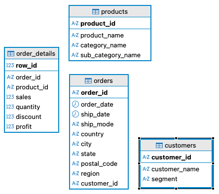
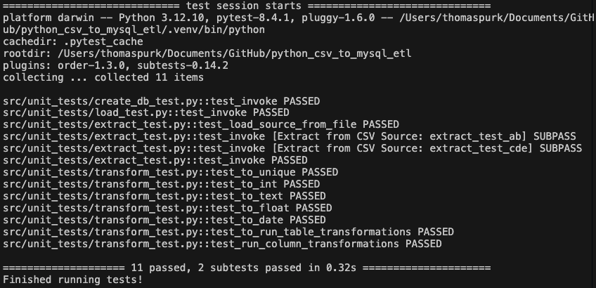

# Python ETL - CSV to MySQL

Transforms a flat CSV file into a MySQL RDBMS. This project employee the MySQL and SQlAlchemy libraries at different points as a way to demonstrate the differenced between the two options. No other special ETL packages are used, only standard Python libraries, so that the processes and realtionships among the extract, transform, and load steps could be exposed via custom functions.

## Development Environment

|               |                        |
| ------------- | ---------------------- |
| Platform      | OS MacOS Sonoma 14.7.4 |
| IDE           | VS Code 1.100.2        |
| Runtime       | Python 3.13.1          |
| Documentation | Markdown / DocString   |
| Unit Testing  | PyTest                 |
| Repository    | GitHub.com             |

### Setup

1. Clone the GitHub repository

   https://github.com/thomaspurk/python_csv_to_mysql_etl

2. Create a virtual Python Environment.
   <br>NOTE: The .venv folder is listed in the .gitignore file.

   ```shell
   python3 -m venv .venv
   source .venv/bin/activate
   pip install -r requirements.txt
   ```

3. Create a .env.development.local file. See the file template.env.development.local for required variables.
   <br>NOTE: The .env.development.local file is listed in the .gitignore file.

### Data

The source of the ETL process is a CSV containing the popular "Superstore" dataset on Kaggle.

https://www.kaggle.com/datasets/vivek468/superstore-dataset-final

This single CSV file contains an unnormalized data set that could be normalized into various forms depending on judgement and preferences. For this project the data is normalized as depicted in the image below. Not that Primary Key - Foreign Key relationships could be added if desired, but are omitted here to avoid contraint errors during data loading.



### Testing

Automated unit testing is performed by PyTest and testing activities were managed by VS Code's built in tools. More information about how to setup VS Code for PyTest can be found here - https://code.visualstudio.com/docs/python/testing

These test cases rely on ordering flags accross multiple test files. Make sure the ordering argument is added to the VS Code settings.json file

```json
{
  "python.testing.pytestArgs": ["src", "--order-scope=session"],
  "python.testing.unittestEnabled": false,
  "python.testing.pytestEnabled": true
}
```

**Unit Test Results**

